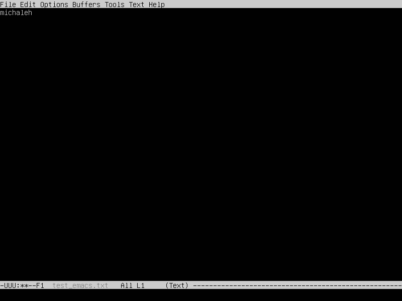

## Part1. OS installation

1. Ubuntu version

    

## Part2. User creation

1. User Creation command

    

2. Adding user `michaleh` to the "adm" group

    `sudo usermod -a -G adm michaleh`

3. The output of cat command shows the new user

    

## Part3. OS network setup

1. Setting the machine name as `user-1`

    `hostnamectl set-hostname user-1`

2. Setting the time zone of our location

    1) find out the current time zone
   
        `timedatectl status`
   
    2) looking for a suitable time zone in the list
   
        `timedatectl list-timezones`
   
    3) setting the selected time zone
   
        `timedatectl set-timezone Europe/Moscow`

3. Use the `ip link show` to display network interfaces

    

    lo interface is an implementation of a virtual network interface that is not related to hardware in any way, but is
    fully integrated into the network infrastructure of a computer system. Any traffic sent by the program to this 
    interface (loopback) is returned to this interface. Using this interface allows you to establish a connection 
    between a client program and a server program running on the same computer regardless of the configuration of 
    hardware systems (no modem, network card, etc. are needed), this interface is implemented using a pseudo device 
    driver in the operating system kernel

4. Dynamic Host Configuration Protocol (DHCP) - is an application protocol that allows network devices to automatically 
    obtain an IP-address and other parameters necessary to operate on a TCP/IP network

    

    This screenshot shows that the current IP address is: 10.0.2.15

5. To get an external IP address, we send a request to the site, which returns the IP address to us

    

    To get the internal IP address, execute the command `ip address`

    

    Internal IP address: 10.0.2.2

6. To set a static IP address, you need to edit the `/etc/netplan/00-installer-config.yml` file as follows

    

    After that, you need to apply the settings

    `sudo netplan apply`

7. We reboot the machine with the `reboot` command

8. Run the `ip address` command to check the static IP address

    

    Static address: 10.0.2.16/24, which corresponds to the settings we specified

9. `Ping 1.1.1.1` shows the Internet is working

    

10. `Ping ya.ru` also shows that the network is configured

    

## Part 4. OS update

1. Updates are installed using commands:
    
    `sudo apt update`
    
    `sudo apt upgrade`

    

    This screenshot shows that there is nothing more to update

## Part 5. Using the sudo command

1. The sudo command allows you to run commands as an administrator, that is, those that require special permission. This
    is done to protect against accidental "shooting yourself in the foot". These privileges should be handled with care,
    as the security and integrity of the system may depend on them.

2. To allow a user to execute the sudo command, you must add him to the sudo group

    `sudo adduser michaleh sudo`

3. We change the machine name on behalf of the user michaleh (this can be seen when choosing from which user we make 
    changes)

    

4. The new machine name is shown in the output of the command

    

## Part 6. Installing and configuring the time service

1. Find out the current time in the local time zone.

    

2. The output of the `timedatectl show` command indicates that synchronization is set

    

## Part 7. Installing and using text editors

1. Since I already have Vim and Nano installed. I also install emacs

    `sudo apt install emacs`

2. To create a file in emacs, open the file with emacs

    `emacs test_emacs.txt` 

3. To exit and save the changes, you must use the keyboard shortcut (control+x) then (control+c), this command will ask
    you to save the file before exiting. When asked whether to save the file - answer yes (y)

    

4. Just like in emacs, in Vim, to create a new file, you need to open it with the desired name 

    `vim test_vim.txt`

5.  To exit Vim and save your changes, you must press `ESC` and type `:wq`

    

6. To create a file in Nano, you need to do the same as in the editors above

    `nano test_nano.txt`

7. This editor has tips with quick commands, when using the combination (control+x), the editor will ask if we want to 
    save the file. We answer - yes (y). And then we can confirm the file name, or write the changes to a separate file.

    

8. To edit a file, you need to open it, we do this the same way as when creating a file

9. To exit Vim without saving, press `ESC` and type `:q!`

    
    
10. To exit emacs without saving, we can use the same method as when exiting with saving, but when asked whether to save
     the file, we answer - no(n)

    

11. To exit Nano, you also need to repeat the same steps as for exiting with saving but answer the question saving - no

    

12. To find a word in Vim, you need to press `ESC`and then enter `:s/<word_we_are_looking_for>`, it will be highlighted

    

13. To replace this word, add to the previous command `/word_to_change_to>`

    

14. To search a word in emacs, you need to use the shortcut (control+s) and then type the word you are looking for

    

15. To replace a word in emacs, you need to use the shortcut (alt+x), and then enter `replace-string`, press `enter`
     enter the word to be replaced, and enter the word we want to replace with

    

16. To find a word in Nano, you must use the shortcut (control+W), and enter the word you are looking for

    

17. To replace a word in nano, you need to use the shortcut (control+\) and enter the word we want to replace, press 
     `enter` and then enter the word we want to replace with and press `enter`

    

## Part 8. Installing and basic configuration of the SSHD service

1.  Install OpenSSH Server

    `sudo apt install openssh-server`

2.  We configure the autostart of the service at the system boot

    `sudo systemctl enable ssh`

3. To change the port, edit the `/etc/ssh/sshd_config` file, adding the line: `Port 2022`

4. To show the presence of the sshd process using the ps command, this command must be used with the `-C` flag and the 
    name of the `sshd` command, this flag implies the output of the process by the name of the command

    

5. Reboot the system with the `reboot` command

6. Install netstat

    `sudo apt install net-tools`

7. We run the `netstat -tan` command, where the `-tan` flag implies three flags:
    `-t` - show the current connection in the stage of transferring the load from the processor to the network 
           adapter
    `-a` - show the status of all sockets, as a rule, sockets used by server processes are not shown,
    `-n` - show network addresses as numbers

    

    The columns in the output means the following

    `Proto` - Protocol used by the socket

    `Recv-Q` & `Send-Q` - In our case (Listen) demonstrates that the program works correctly with the receiving 
                          and sending side (returns 0).

    `Local Address` - Shows the local address and port, 0.0.0.0 - means that the service can connect to all network 
                      interfaces. It allows you to listen and accept connections from any IP address

    `Foreign Address` - remote address (similar of the local address for the other side)

    `State` - socket status. In our case, the socket is listening for incoming connections. Such connections are not 
              included  in the output without the `-a` flag

## Part 9. Installing and using the top htop utilities

1. I already have top and htop installed

    Based on the output from top

    uptime - 40 min;
    
    number of the authorized users - 1 user;

    total system load - 0,00

    total number of the processes - 95

    cpu load - 0,0(0,3)

    memory load - 2941,4 MiB

    pid of the process taking the most memory - systemd

    pid of the process taking the most CPU time - top

2. htop output sorted by PID

    

3. htop output sorted by PERCENT_CPU

    

4. htop output sorted by PERCENT_MEM

    

5. htop output sorted by TIME

    

6. htop output filtered by sshd process

    

7. htop output with syslog process found using search

    

8. htop output with hostname, clock and uptime output added

    

## Part 10. Using te fdisk utility

1. HDD name - /dev/sda

2. HDD size - 10 GiB

3. Number of sectors - 20971520

4. Swap size - 907M

## Part 11. Using the df utility

1. For root partition with df utility

    1) Partition size - 9299276

    2) Used space - 4516216

    3) Free space - 4289084

    4) Usage percent - 52%

2. For root partition with df utility and -Th flag

    1) Partition size - 8,9G

    2) Used space - 4,4G

    3) Free space - 4,1G

    4) Usage percent - 52%

3. File system type ext4

## Part 12. Using du utility

1. du output

    

2. du output with flags

    `-b` - fot output in bytes

    `-h` - for output in human-readable form

    `-s` - for summary output by directory

    

3. Printing the size of all content in `/var/log` using the command

    `sudo du -b -h /var/log/*`

    

## Part 13. Installing and using the ncdu utility

1. Install the ncdu utility

    `sudo apt install ncdu`

2. Print the size of /var/log with the `ncdu /var/log` command

   

3. Print the size of /var with the `ncdu /var` command

    

4. Print the size of /home with the `ncdu /home`

    

## Part 14. Work with system logs

1. Time of the last successful authorization - August 1 12:44:32

2. User name - user

3. Login method (login:session)

4. SSHd restart message

    

## Part 15. Using the CRON Job Scheduler

1. Run the uptime command every two minutes

    

2. View current CRON jobs

    

3. View current tasks after deleting tasks from the scheduler

    